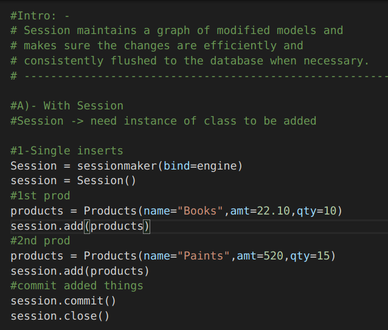
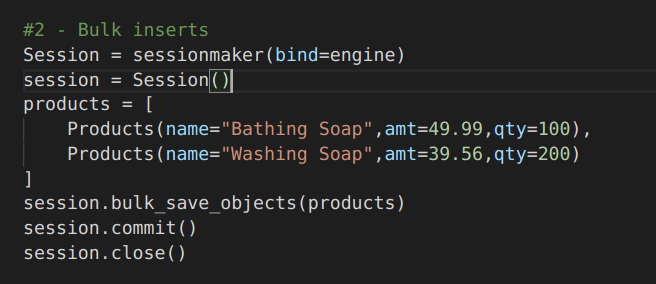
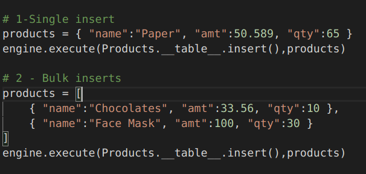
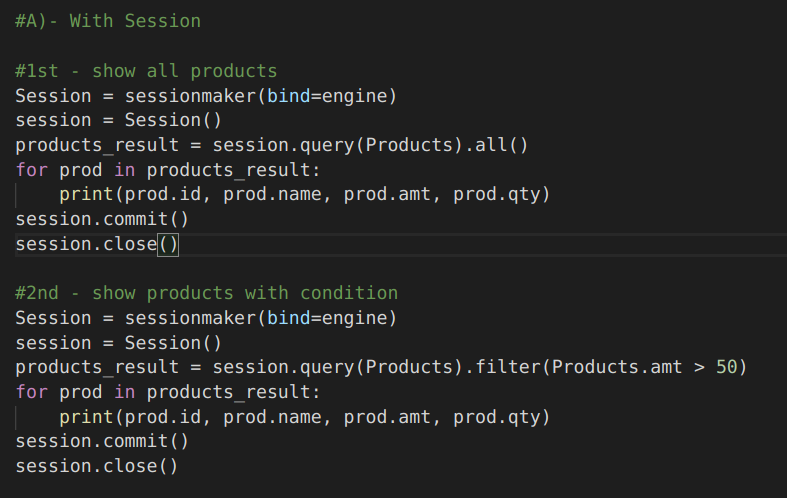
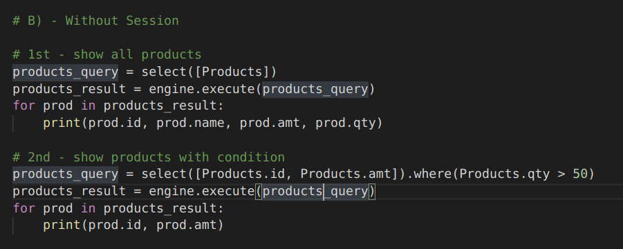

# SQL-Alchemy-Tutorial
A simple tutorial on how to use SQL Alchemy

## How To Start Project in VS Code :
- First clone this project & open in VS Code. 
- Run these commands in your terminal 

1. source venv/bin/activate
2. virtualenv venv
3. Replace your password and database name in <b>sectrets.py</b>
4. To run a file : python filename.py

## Explaination of each file

### engine.py
This file contains a connection object which will help your project to connect with mysql

### modals.py
This file contains all the table names used in our project, with the data-type of each column. If you run this file separately, you will be able to create tables in your database. 

### insert.py
This file shows different ways to insert data into your desired tables - with and without session. Check the file & read the comments to know more.

<table>
  
  <tr>
    <th>Single insert with session</th>
    <th>Bulk insert with session</th>
    <th>Single & Bulk insert without session</th>
  </tr>
  
  <tr>
    <td></td>
    <td></td>
    <td></td>
  </tr>
  
</table>

### show.py
This file shows different ways to retrieve data from your desired tables - with and without session. Check the file & read the comments to know more.

<table>
  
  <tr>
    <th>Show with session</th>
    <th>Show without session</th>
  </tr>
  
  <tr>
    <td></td>
    <td></td>
  </tr>
  
</table>